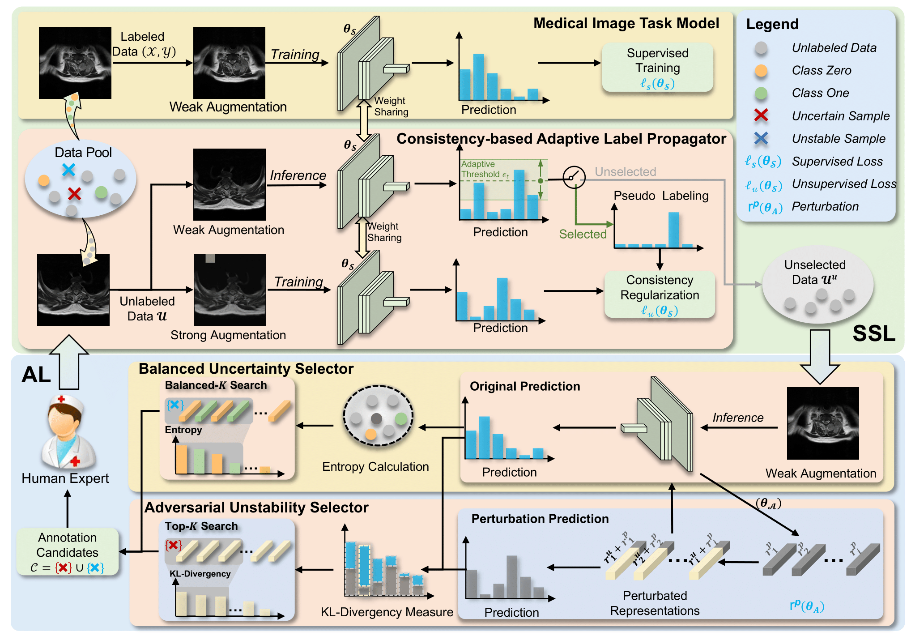

## 📄 About

This repository contains **code for our paper published in CVPR 2022**:

> **"BoostMIS: Boosting Medical Image Semi-supervised Learning with Adaptive Pseudo Labeling and Informative Active Annotation (https://dl.acm.org/doi/10.1145/3448016.3457321)"**
.

# Abstract
In this paper, we propose a novel semi-supervised learning (SSL) framework named BoostMIS that combines adaptive pseudo labeling and informative active annotation to unleash the potential of medical image SSL models:
(1) BoostMIS can adaptively leverage the cluster assumption and consistency regularization of the unlabeled data according to the current learning status.  This strategy can adaptively generate one-hot "hard" labels converted from task model predictions for better task model training. (2) For the unselected unlabeled images with low confidence,  we introduce an Active learning (AL) algorithm to find the informative samples as the annotation candidates by exploiting virtual adversarial perturbation and model's density-aware entropy.
These informative candidates are subsequently fed into the next training cycle for better SSL label propagation.  Notably, the adaptive pseudo-labeling and informative active annotation form a learning closed-loop that are mutually collaborative to boost medical image SSL.  To verify the effectiveness of the proposed method, we collected a metastatic epidural spinal cord compression (MESCC) dataset that aims to optimize MESCC diagnosis and classification for improved specialist referral and treatment. We conducted an extensive experimental study of BoostMIS on MESCC  dataset. The experimental results verify our framework's effectiveness  with a significant improvement over various state-of-the-art methods.

<div align=center></div>

[Article link](https://arxiv.org/abs/2203.02533) _(Published on arxiv: Mar 4, 2022 )_

## 🎓 What’s In This Repo

The proposed dataset and framework implementations of our paper are as follows:

## Environment

- Python==3.7
- Pytorch==1.9.1
- cuda=10.2


## Dataset 
The MESCC dataset contains two classification task: two-grading (low-grade and high-grade) and six-grading (b0, b1a, b1b, b1c, b2, b3). Six samples as follows:

<div align=center></div>


This is the [**Dataset link**](https://www.dropbox.com/s/56xjee1symuu2vv/MESCC%20dataset.zip?dl=0). The *-features.npy files are the MRI image features extracted from the pre-trained Resnet50 (from https://download.pytorch.org/models/resnet50-19c8e357.pth).  

The *-targets.npy files are the labels for two-grading and six-grading. For two-grading, 0 and 1 are the low-grade and high-grade, respectively. For six grading, 0, 1, 2, 3, 4, 5 and 6 correspond to b0, b1a, b1b, b1c, b2 and b3, respectively.


## Dataset Statistic

Two-grading statistics of the MESCC dataset.
|  -----| Low-grade | High-grade |Total|
| ----- | ------ | ------ | ------ |
| Train | 4,644 | 563 |5,207 |
| Val | 917 |94 |1,011|
| Test | 982 |95 |1,077 |
| Total | 6,543| 752| 7,295 |

Six-grading statistics of the MESCC dataset.

|  -----| b0 | b1a | b1b| b1c| b2| b3| Total|
| ----- | ------ | ------ | ------ |------ |------ |------ |------ |
| Train | 3,752 |409 |483 |224 |136 |203 |5,207|
| Val | 756 |73 |88 |50 |23 |21 |1,011|
| Test | 849 |82 |51 |39 |30| 26| 1,077|
| Total | 5,357 |564 |622 |313|189 |250 |7,295|


## Run the code
bash train.sh

## 🤝 Referencing and Citing 

If you find our work useful in your research and would like to cite our Radiology paper, please use the following citation:

```
@inproceedings{zhang2022boostmis,
      title={BoostMIS: Boosting Medical Image Semi-supervised Learning with Adaptive Pseudo Labeling and Informative Active Annotation}, 
      author={Zhang, Wenqiao and Zhu, Lei and Hallinan, James and Zhang, Shengyu and Makmur, Andrew  and Cai, Qingpeng and Ooi, Beng Chin},
      booktitle={Proceedings of the IEEE/CVF Conference on Computer Vision and Pattern Recognition},
      year={2022}
}
```
